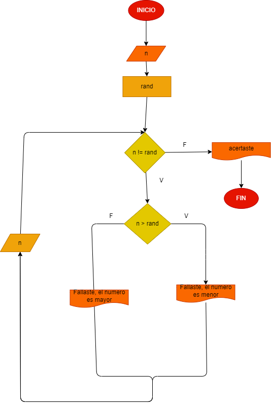

# Adivinar_el_numero

# Analisis
Se evaluara cada número ingresado y se le dira al usuario si el número que ingreso es mayor o menor al generado aleatoriamente, y si el número es igual se le dira al usuario que acerto.

## Diagrama de flujo.

